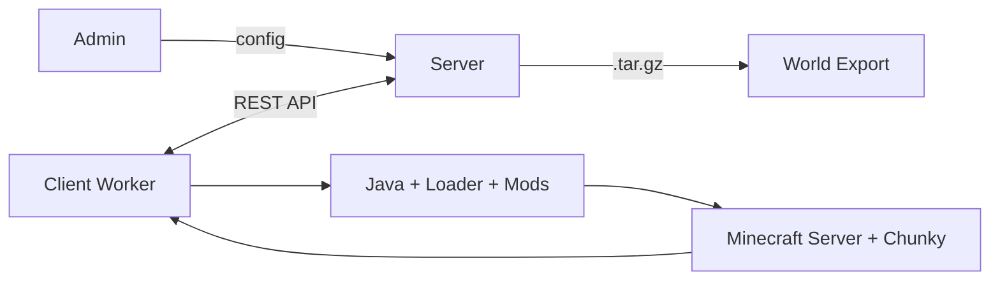

# ChunkDMesh

Distributed platform for Minecraft world pre-generation. Volunteer clients generate chunks in parallel, a central server orchestrates and assembles the result.

## Requirements

- Python 3.11+
- [uv](https://docs.astral.sh/uv/getting-started/installation/) (recommended) or pip

## Install

```sh
# With uv (recommended)
git clone https://github.com/YoannDev90/ChunkDMesh.git
cd ChunkDMesh
uv sync --extra dev

# With pip
python -m venv .venv
source .venv/bin/activate
pip install -e ".[dev]"
```

## Usage

### Configure your world

Edit [`server/config/world_config.json5`](/server/config/world_config.json5):

```json5
{
  minecraft_version: "1.20.4",
  minecraft_loader: "fabric",
  loader_version: "0.16.14",
  chunky_version: "2.7.4",
  world_name: "MyWorld",
  dimension: "overworld",     // "overworld", "nether", "end"
  center: [NaN, NaN],         // [x, z] — defaults to spawn
  seed: NaN,                  // defaults to random
  radius: 1024,               // render radius in chunks (16 blocks each)
  shape: "square",            // "square", "circle", "diamond"
  pattern: "regions",         // "regions", "loop"
  max_clients: NaN,           // no limit
  chunk_format: "sha256",
  verification: false,        // double-generation integrity check
}
```

### Launch server (TUI)

```sh
uv run python run.py server
```

Server starts at `http://localhost:8000` with a live Rich TUI showing task stats, active clients, recent requests, and server metrics.

### Launch client (TUI)

```sh
uv run python run.py client
```

Client connects to the server, benchmarks CPU, and generates chunks. The Rich TUI displays status, progress bar, per-step metrics, and system stats.

### Launch both (server + client)

```sh
uv run python run.py both
```

Starts server in background and client in foreground with a **unified TUI** that shows both server stats (tasks, requests, storage) and client progress (status, Chunky progress bar, per-step metrics) in a single screen.

### CLI options

| Flag | Description |
|------|-------------|
| `--host HOST` | Server bind address (default: `0.0.0.0`) |
| `--port PORT` | Server port (default: `8000`) |
| `--world-config PATH` | Path to world config JSON5 file |
| `--bg` / `--background` | Client background mode (no TUI, plain output) |
| `--raw-cli` | Server raw CLI mode (no TUI, plain output) |

Examples:

```sh
# Custom port + config
uv run python run.py server --port 9000 --world-config my_world.json5

# Background client (logs to stdout)
uv run python run.py client --bg

# Server without TUI (for systemd / Docker)
uv run python run.py server --raw-cli
```

### Direct module launch

You can also run server and client directly without `run.py`:

```sh
# Server directly
uv run python -m server.main

# Client directly
uv run python client/main.py --bg
```

## Web dashboard

| URL | Description |
|-----|-------------|
| `http://localhost:8000/admin` | Admin dashboard — heatmap, stats, progress |
| `http://localhost:8000/admin/map` | Interactive Rust-rendered map viewer |
| `http://localhost:8000/admin/stats` | JSON stats endpoint (storage + batches) |
| `http://localhost:8000/admin/heatmap` | JSON heatmap data |
| `http://localhost:8000/docs` | OpenAPI docs (Swagger UI) |

### Map viewer

The map viewer renders Minecraft regions to PNG tiles using a Rust bridge. Supports zoom levels 0–5, hover tooltips with block/biome data, and tiles are cached on disk.

### Export

```sh
# Export world via API
curl -X POST http://localhost:8000/admin/export \
  -H "Authorization: Bearer <token>"

# Download exported archive
curl -O http://localhost:8000/admin/download/<filename>.tar.gz
```

## Architecture



## Flow

1. Admin configures world (seed, radius, shape, MC version, loader)
2. Server splits zone into region tasks (32x32 chunks each) in spiral order
3. Clients connect with power score benchmark, get JWT + batch of regions
4. Each client detects/downloads Java, installs loader + mods, launches headless MC server
5. Chunky generates chunks via RCON commands
6. Clients Zstd-compress `.mca` files and upload with SHA-256 hashes
7. Server validates hashes, optionally double-checks with redundant generation
8. Assembler copies validated regions to exports directory
9. Exporter creates `.tar.gz` archive ready for use

## Features

- **Multi-loader**: Fabric, Forge, Quilt, NeoForge
- **Heartbeat**: Clients send periodic heartbeats; dead clients auto-reassign their tasks
- **Verification**: Optional double-generation for integrity checking
- **S3/R2**: Cloud storage for ephemeral deployments (Render, Vercel)
- **P2P**: BitTorrent distribution for mods.zip
- **Heatmap**: Real-time interactive map of generation progress
- **Benchmark**: Client speed scoring for fair task distribution
- **Rust tiler**: Fast region-to-PNG rendering for map viewer
- **TUI**: Rich-based terminal UIs for both server and client

## Testing

```sh
uv run pytest -v
```

## Linting

```sh
uv run ruff check .
uv run ruff format --check .
uv run mypy server/ --ignore-missing-imports
```

## Licence

Apache v2.0 -- see [`LICENSE`](/LICENSE)
