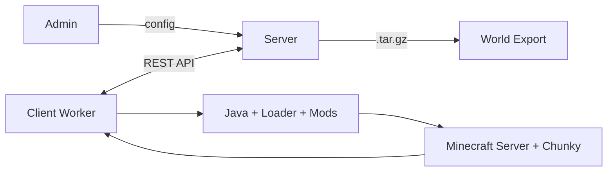

# ChunkDMesh

Distributed platform for Minecraft world pre-generation. Volunteer clients generate chunks in parallel, a central server orchestrates and assembles the result.

## Requirements

- Python 3.10+
- See [`requirements.txt`](/requirements.txt) for dependencies

## Install

```sh
python -m venv .venv
source .venv/bin/activate
pip install -r requirements.txt
```

## Usage

### Configure your world

Edit [`server/config/world_config.json5`](/server/config/world_config.json5) with MC version, loader, seed, radius, shape.

### Launch server

```sh
python run.py server
```

Server starts at `http://localhost:8000`.

### Launch client (worker)

```sh
python run.py client
```

### Launch both (server + client)

```sh
python run.py both
```

### Dashboard

- Admin dashboard: `http://localhost:8000/admin`
- Interactive map: `http://localhost:8000/admin/map`
- API docs: `http://localhost:8000/docs`

## Architecture



## Flow

1. Admin configures world (seed, radius, shape, MC version, loader)
2. Server splits zone into region tasks (32x32 chunks each) in spiral order
3. Clients connect with power score benchmark, get JWT + batch of regions
4. Each client detects/downloads Java, installs loader + mods, launches headless MC server
5. Chunky generates chunks via RCON commands
6. Clients Zstd-compress `.mca` files and upload with SHA-256 hashes
7. Server validates hashes, optionally double-checks with redundant generation
8. Assembler copies validated regions to exports directory
9. Exporter creates `.tar.gz` archive ready for use

## Features

- **Multi-loader**: Fabric, Forge, Quilt, NeoForge
- **Verification**: Optional double-generation for integrity checking
- **S3/R2**: Cloud storage for ephemeral deployments (Render, Vercel)
- **P2P**: BitTorrent distribution for mods.zip
- **Heatmap**: Real-time interactive map of generation progress
- **Benchmark**: Client speed scoring for fair task distribution
- **Rust tiler**: Fast region-to-PNG rendering for map viewer

## Licence

Apache v2.0 -- see [`LICENSE`](/LICENSE)
